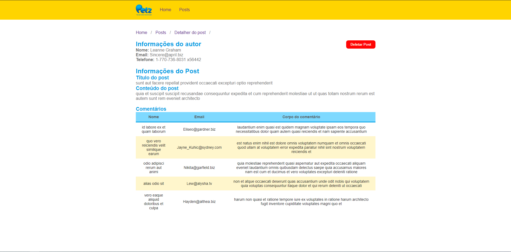

# Teste para a vaga de desenvolvedor Frontend na Petz

# Bibliotecas usadas
### React JS
  Uma famosa biblioteca para criações SPAs (Single page application) bem completas.
### Next JS
 Framewok criado para otimizar e melhorar o SEO de aplicações react.
### react-hook-form
   Biblioteca utilizada para validação de formulários de forma fácil e performática.
### Axios 
   Biblioca utilizada para fazer requisições http com todos os verbos disponíveis. É ótima para criar padrões de url e evitar repetições no código.
### React Icons
   Biblioteca utilizada para obter os mais diversos ícones open source da comunidade.
### Styled Components
Biblioteca que ajuda na estilização do código de maneira fácil e escalável. É bem parecida com o SASS, mas é focada na estilização de componentes React.
# Design da aplicação:
### Listagem de posts

O design foi feito assim para ser simples e fácil de entender, a melhor forma de vizualizar muitos dados assim são por tabelas, e por brevidade coloquei apenas os campos essenciais para a tela.

### Detalhes do post

Seguindo o mesmo principio de ser simples, desenhei a tela para mostrar os dados de forma organizada seguindo uma ordem lógica. Primeiro as informações do autor, depois todas as informações do Post.

# Acesso da aplicação
A aplicação pode ser acessada clicando [aqui](https://petz-blog-ocqqj0f15.vercel.app).
Não é necessário baixar para ver o resultado, mas caso queira ter a experiência basta seguir os passos a baixo.

1. Clone este repositório
   ```bash
   git clone https://github.com/xpiral14/test-petz
   ```
2. Entre na pasta que acabou de clonar e execute o comando de instalação das bibliotecas
   ```bash
    cd test-petz & yarn
   ```
   ou
    ```bash
    cd test-petz & npm install
   ```
3. Espere a instalação terminar e execute
    ```bash
        yarn dev
    ```
    ou
    ```bash
        npm run dev
    ```
4. Espere a mensagem: `event - compiled successfully` e então abra seu navegador em  http://localhost:3000.


This is a [Next.js](https://nextjs.org/) project bootstrapped with [`create-next-app`](https://github.com/vercel/next.js/tree/canary/packages/create-next-app).

# Explicação do design
O design foi feito para ser simples e fácil de entender.
## Getting Started

First, run the development server:

```bash
npm run dev
# or
yarn dev
```

# Observação
As cores foram usadas de acordo com as passadas no site
